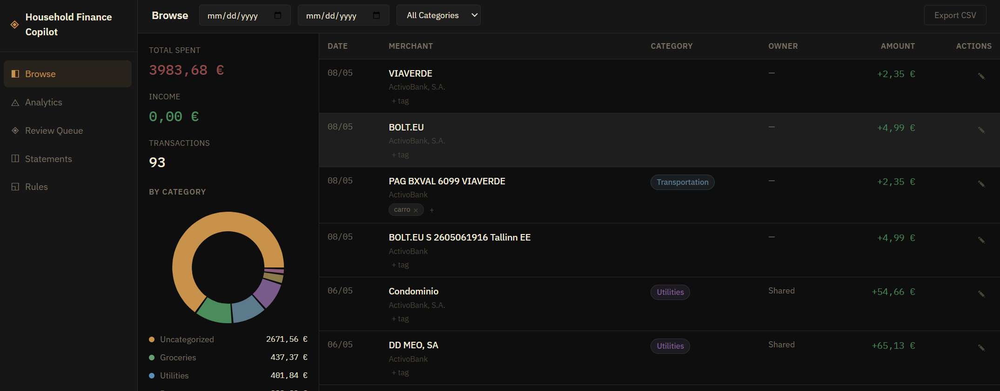
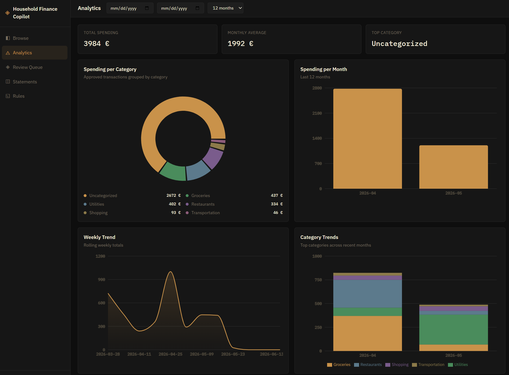
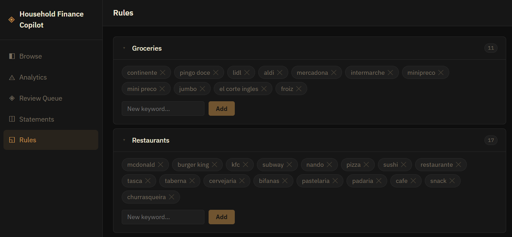

# Household Finance Copilot

An AI-powered household finance platform for Rafael and Heloisa. Ingests bank statements via Gmail or manual upload, extracts transactions using Google Gemini Flash, and provides a full review + analytics suite.

## Why this exists

Most personal finance tools assume you live in one country, bank with one institution, and want your data sent to a third-party cloud. That doesn't work well for a household that spans multiple Portuguese banks, has joint and individual expenses, and values keeping financial data off external servers.

This app exists to answer one simple question: *where is our money going?* Bank statements arrive as PDFs or images across several email accounts. Logging into each bank's portal to piece together a monthly picture is tedious and error-prone. This tool automates the ingestion — polling email attachments, running vision AI over the documents, and landing everything in a single review queue where transactions can be confirmed, corrected, and categorised before hitting the database.

The review step is intentional. AI extraction isn't perfect, especially across different bank layouts and receipt formats. Rather than silently accepting every parsed transaction, the app surfaces low-confidence extractions for human review. High-confidence ones are approved automatically; the rest wait in the queue. Nothing enters the analytics until someone has signed off on it.

## Who it's for

Built for two people: **Rafael** and **Heloisa**. Transactions are tagged per person or as shared, so monthly spend can be broken down individually or as a household. It's a private, self-hosted tool — not a product, not a SaaS, not designed to scale beyond a single home.

## Features

- **Multi-bank ingestion**: Accepts screenshots and PDFs from Portuguese banks (e.g. Millennium BCP, Caixa Geral, Santander PT) — designed to work across different countries' statement layouts
- **AI extraction with Groq**: Uses Llama 3.3 70B (text PDFs) and Llama 3.2 11B Vision (images/scanned PDFs) — free tier friendly
- **Review queue**: Every extracted transaction goes through a confidence-gated review queue before being committed to the database
- **Source document viewer**: Each transaction in the review queue can display its original receipt or bank statement — view inline or download
- **Analytics dashboard**: Monthly spend by category, trends, and per-user breakdowns
- **Authentication**: Login/logout with session token management

## Tech Stack

| Layer | Technology |
|-------|-----------|
| Backend API | Python + FastAPI (port 8000) |
| Frontend | React 19 + Vite (port 5173) |
| Database | PostgreSQL via Supabase |
| AI / Vision | Groq — Llama 3.3 70B (text) + Llama 3.2 11B Vision (images) |
| Email ingestion | Gmail API (`google-api-python-client`) |
| Deployment | Vercel (frontend) + Render (backend) + Supabase (DB) |

## Quick Start (local)

```bash
# 1. Clone the repo
git clone <repo-url>
cd Household-Finance-Copilot

# 2. Configure backend environment
cp backend/.env.example backend/.env
# Edit backend/.env — set GROQ_API_KEY and DATABASE_URL (Supabase connection string)

# 3. Install backend dependencies
pip install -r requirements.txt

# 4. Start the backend
uvicorn backend.main:app --reload --port 8000

# 5. Install frontend dependencies
cd frontend-react && npm install

# 6. Configure frontend environment
echo "VITE_API_BASE=http://localhost:8000" > .env

# 7. Start the frontend
npm run dev

# Frontend: http://localhost:5173
# Backend API docs: http://localhost:8000/docs
```

Test credentials (local dev only):
- `rafael` / `rafael123`
- `heloisa` / `heloisa123`

> **Without `GROQ_API_KEY`**: app runs in test mode — uploads and Gmail attachments are accepted but no transactions are extracted.

## Gmail Setup

Ingesting emails requires Google Cloud credentials:

1. Create a project in [Google Cloud Console](https://console.cloud.google.com/)
2. Enable the Gmail API
3. Create OAuth 2.0 credentials (Desktop app)
4. Download `credentials.json` and place it in the project root
5. On first run, the backend opens a browser for OAuth consent — a `token.json` is saved locally for subsequent runs
6. The poller runs every 5 minutes by default, fetching emails with PDF/image attachments

Relevant `.env` vars (all optional — defaults work out of the box):

```
GMAIL_CREDENTIALS_PATH=credentials.json
GMAIL_TOKEN_PATH=token.json
GMAIL_POLL_INTERVAL=300
```

Both `credentials.json` and `token.json` are gitignored and must never be committed.

> **Multiple email accounts**: set up forwarding from all statement-receiving accounts to one dedicated Gmail and point the poller at that account.

## Privacy

No real financial data is stored in this repository. The `data/` directory is gitignored.

## Architecture

```
  Browser → Vercel CDN (React SPA, port 5173 local)
                  ↓ HTTPS API calls
          Render / localhost (FastAPI, port 8000)
                  |
                  ├── Groq API (Llama 3 — text + vision extraction)
                  ├── Gmail API (background poller thread)
                  └── Supabase (PostgreSQL)
                            ├── transactions
                            ├── documents (BLOB)
                            ├── tags / transaction_tags
                            ├── category_rules
                            └── gmail_poll_state
```

## Screenshots

**Transactions**


**Analytics**


**Category Rules**


## Architecture Decisions

| ADR | Decision | Status |
|-----|----------|--------|
| [ADR-001](docs/ADR.md#adr-001--ai-vision-model-google-gemini-flash) | AI model: Google Gemini Flash | Superseded by ADR-010 |
| [ADR-002](docs/ADR.md#adr-002--database-duckdb) | Database: DuckDB | Superseded by ADR-011 |
| [ADR-003](docs/ADR.md#adr-003--email-ingestion-gmail-api-oauth-polling) | Email ingestion: Gmail API OAuth polling | Accepted |
| [ADR-004](docs/ADR.md#adr-004--deployment-local-docker-compose) | Deployment: Local Docker Compose | Superseded by ADR-012 |
| [ADR-005](docs/ADR.md#adr-005--confidence-threshold-090) | Confidence threshold: 0.90 | Accepted |
| [ADR-006](docs/ADR.md#adr-006--owner-assignment-email-subject-convention) | Owner assignment: email subject convention | Accepted |
| [ADR-007](docs/ADR.md#adr-007--privacy-gitignore-data--dbt-seed-demo-data) | Privacy: gitignore data | Accepted |
| [ADR-008](docs/ADR.md#adr-008--duckdb-connection-singleton-pattern) | DB connection: DuckDB singleton | Superseded by ADR-011 |
| [ADR-009](docs/ADR.md#adr-009--gemini-input-inline-base64-vs-file-upload-api) | Gemini input: inline base64 | Accepted |
| [ADR-010](docs/ADR.md#adr-010--ai-extraction-model-groq-llama-3) | AI model: Groq + Llama 3 | Accepted |
| [ADR-011](docs/ADR.md#adr-011--database-postgresql-via-supabase) | Database: PostgreSQL via Supabase | Accepted |
| [ADR-012](docs/ADR.md#adr-012--deployment-vercel-frontend--render-backend--supabase-database) | Deployment: Vercel + Render + Supabase | Accepted |
| [ADR-013](docs/ADR.md#adr-013--frontend-react--vite-replacing-streamlit) | Frontend: React + Vite | Accepted |

## Users

- **Rafael**
- **Heloisa**
- **Shared** — joint expenses tracked separately
